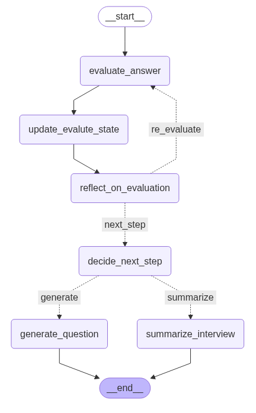
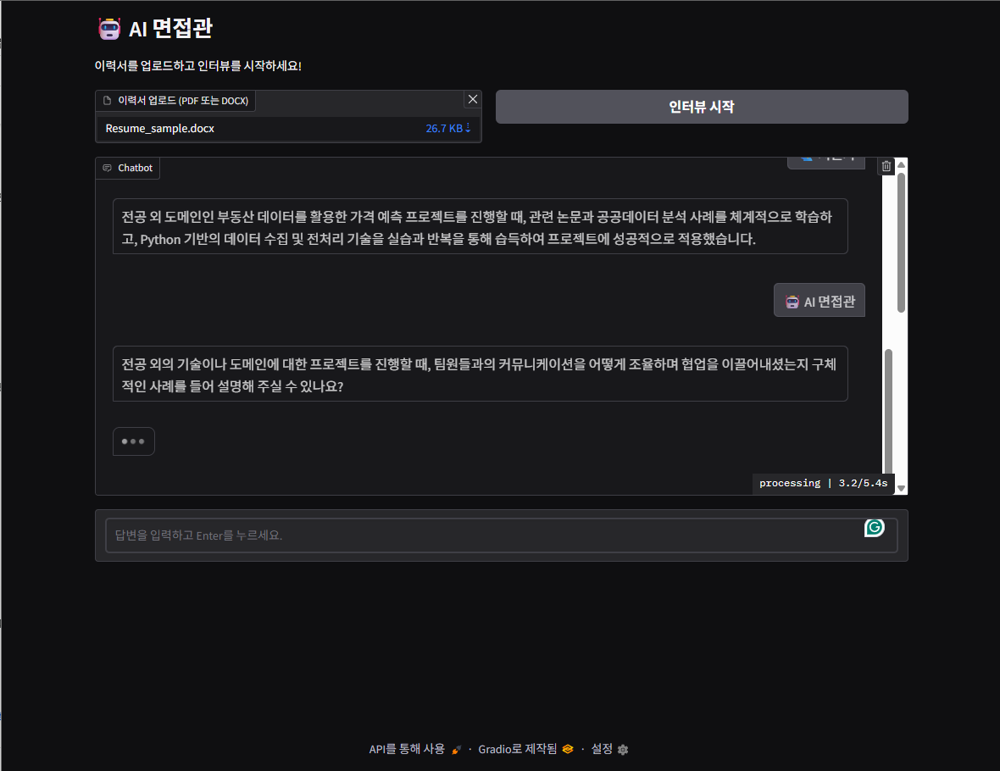
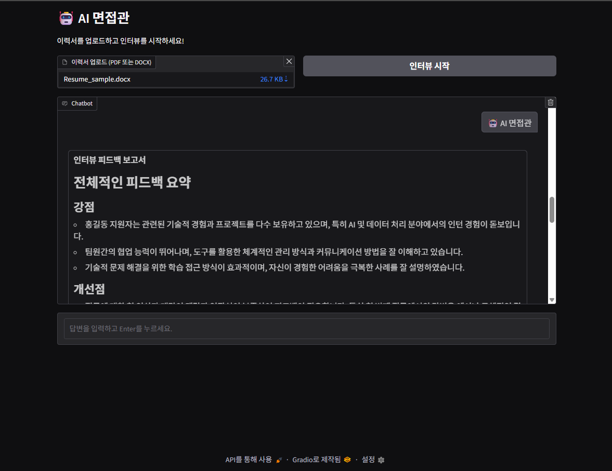
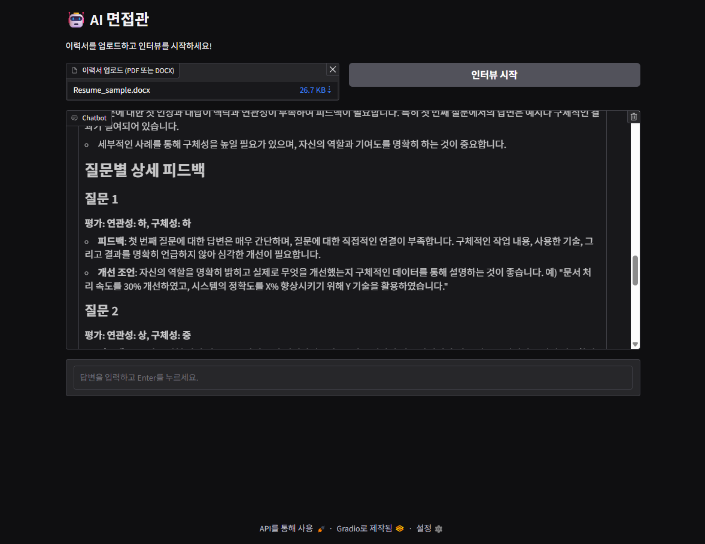
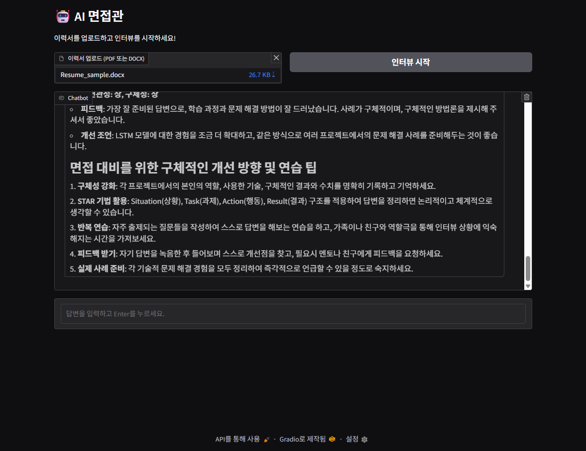

# AI 면접관 Agent

생성일: 2025년 5월 12일 오전 10:56

[Aivle 스쿨 2차 미니프로젝트]

📅 기간: 2025.05.09 - 2025.05.12

🎯 목표: LangGraph를 이용한 AI 면접관 Agent 구축

🗃️ 사용 데이터: GPT 생성 이력서

### 🛠️ 역할

- Agent 1.0 그라운드 코드 제작
- Agent 2.0 인터뷰 진행 검토 고도화 담당
- 프로젝트 전체 코드 자체 병합

### ✅ 주요 기술 스펙 (Tech Stack)

- **Programming Language**
    - Python
- **AI Model & API**
    - OpenAI GPT-4o-mini (ChatOpenAI)
    - OpenAI text-embedding-3-small (OpenAIEmbeddings)
- **Frameworks & Libraries**
    - **LangChain**: LLM chains, retrievers, output parsers
    - **LangGraph**: State Machine 기반 agent workflow 설계
    - **Gradio**: Web UI 인터페이스 (파일 업로드, 실시간 대화)
    - **Chroma**: Vector database (유사 질문 검색용)

### 🔍 주요 내용

- 이력서 기반 **AI 모의면접 시스템** 개발
- **다단계 인터뷰 플로우** 구축 (LangGraph 기반 State Machine)
    - **1단계**: 이력서 분석 → 요약, 핵심 키워드 추출
    - **2단계**: 3가지 전략(경력/경험, 동기/커뮤니케이션, 논리적 사고) 기반 질문 자동 생성
    - **3단계**: 답변 평가 (관련성, 구체성) → 결과에 따라 추가 질문 또는 종료
- 유사 질문 검색: **Chroma 벡터 DB + OpenAI Embedding** 기반
- 사용자 입력 답변 평가 및 **Self-reflection + Re-evaluation** 반복 구조 설계
- 인터뷰 종료 시 **면접 피드백 보고서 자동 생성**
- **Gradio UI**를 통한 실시간 대화형 인터페이스 제공
    

### 🎊 결과물

  
  
  
  
  

### 📚 배운 점

- 상태 기반 플로우 제어의 중요성
    - 복잡한 AI 인터뷰 흐름(이력서 분석 → 질문 → 답변 평가 → 추가 질문 → 피드백 생성 등)을 명확하게 상태로 정의하고 관리하는 것이 핵심
    - 상태(State) 객체 중심으로 인터뷰 로직을 설계하는 경험
- 상태 기반 재평가 로직 경험
    - `reflection_status`, `re_evaluate_count` 같은 추가 상태 값을 직접 정의하고, 조건부 분기 (re_evaluate vs next_step) 로 반영.
    - 무한 루프 방지를 위해 state 기반 카운트 제어 (`re_evaluate_count >= 2`) 등 실제 프로덕션 품질에 가까운 예외처리 학습
- 상태 변화 로깅의 필요성 인식
    - 디버깅 및 테스트 과정에서 log 출력의 중요성을 체감.